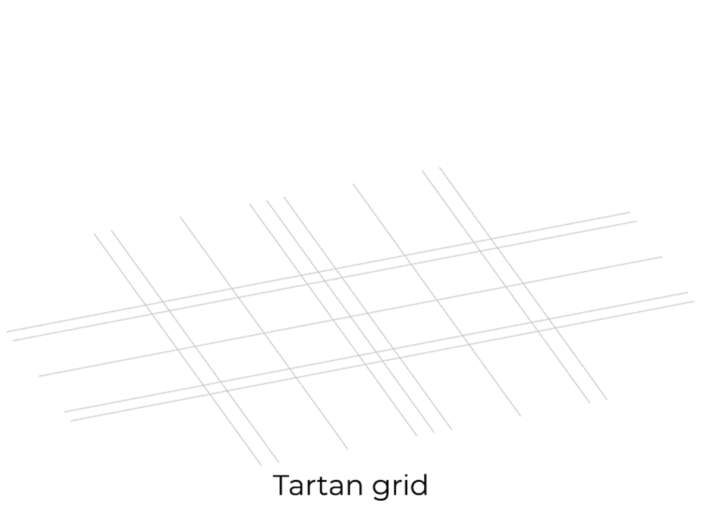
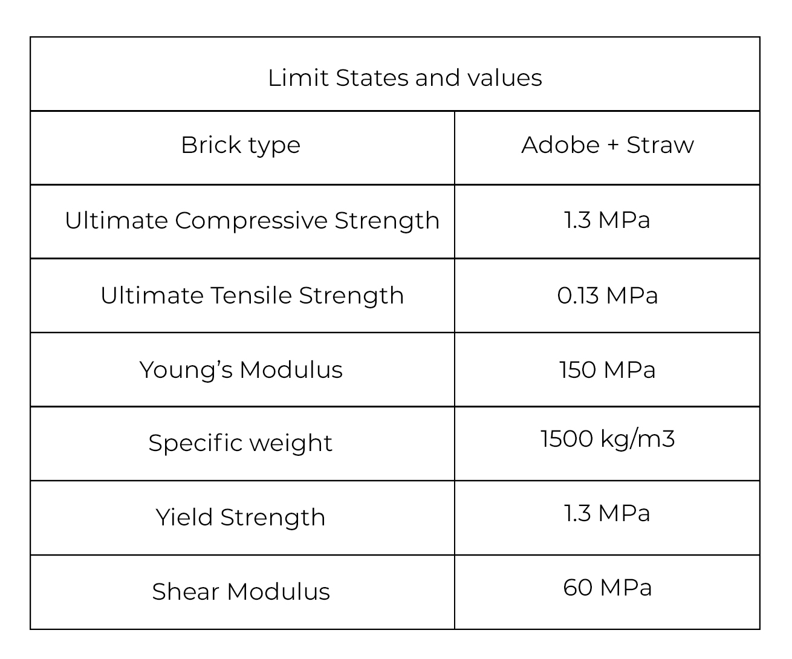
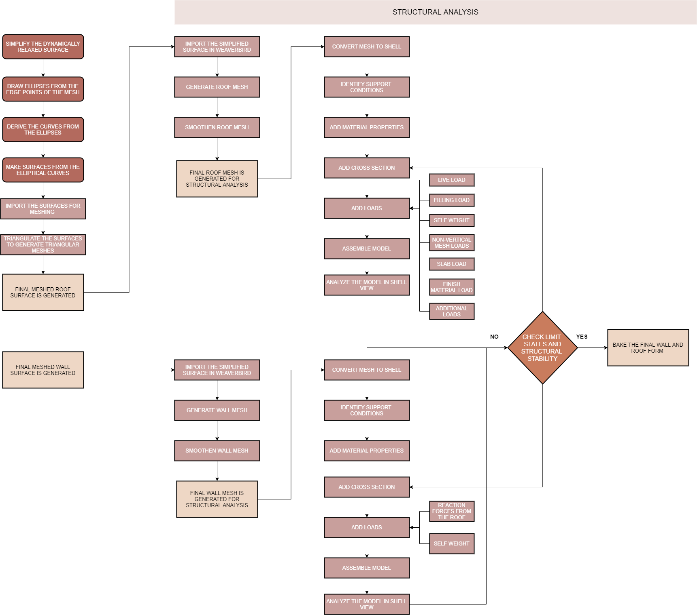
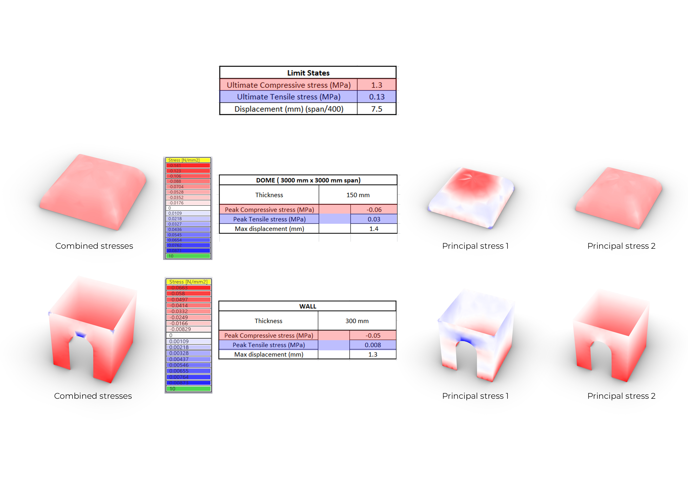
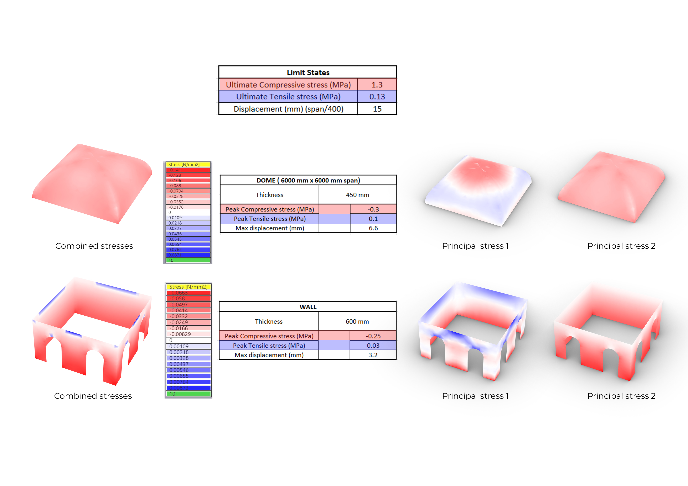
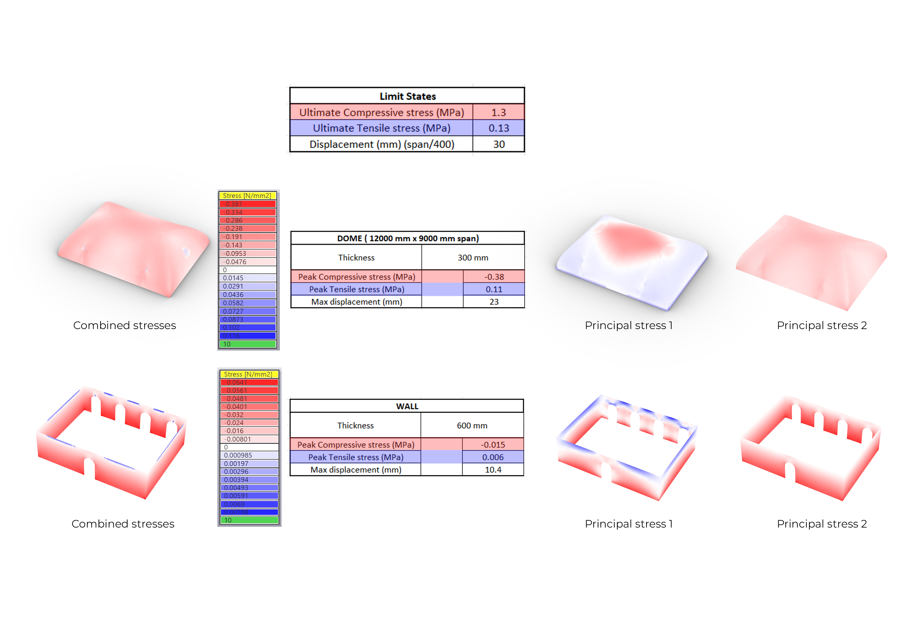

## 0_Introduction 

 
This site documents the design process of RAHA, a recreational center designed within the borders of the Zaatari camp. RAHA is an Arabic word meaning comfort, rest or relaxation; it is also an acronym for recreational activity hub actuator. The intention behind the design of the building is to create a recreational facility where the refugees in the camp can interact with one another while participating in culturally relevant activities. The recreational hub contains programmatic functions that allow for the refugees to relieve their stress and engage in informal counseling and therapeutic activities. While the social objectives are to re-introduce a sense of normalcy for the camp residents; the design of the building explores the use of computation for creating 21st C earth buildings. 

The design process is explained in 4 stages: Configuring, shaping, structuring and Constructability. The configuration stage starts with identifying a problem that can be addressed by a missing building on a selected site followed by defining the programs and their co-responding relationship. In the shaping phase, the form-finding of the building is studied where different roof tessellations are explored. This is followed by the structuring phase where the building form is structurally analyzed using karamba. In line with the structuring phase, the ease of construction was studied where different construction methods and sequences are tested. Based on the design progression, the final output is presented with the chosen construction method and defined bricks and modules. 

### About Zaatari

 
The Zaatari camp is the largest camp for Syrian refugees set up in Jordan following the breakout of the Syrian civil war in 2011. The camp started operating in 2012 admitting 15,000 refugees by August 2012. The number of refugees in the camp increased over the years to a staggering 78,357 by October 2018. During this time, the camp evolved from a small collection of tents into a permanent urban settlement. 

The camp is divided into 12 districts, there are 32 schools and 52 community centers. Presently the UNHCR coordinates the infrastructure improvements and shelter assistance within the camp along with the provision of energy supply. There are pre-fabricated shelters including latrine and kitchen. 

### Problem statement

 
The Zaatari camp houses a large number of Syrian refugees. Although the camp was set-up as a short-term accommodation the ongoing war has prolonged the duration to latent permanency. As a result, long-term solutions are required not only in accommodation but also by providing adequate and culturally relevant community-based facilities that also work towards informally addressing underlying issues related to the holistic well-being of the refugees.

Refugees residing in the camp come from a war-ridden place, they have had traumatic experiences most of which have lost loved ones and left loved ones behind. Research shows various distresses reported among refugees including avoidance, anger, helplessness, fear and reduced functioning. The various types of distress result in the deterioration of the refugee’s mental well-being and hinder their chance of having a stable normal life. As the number of residents within the camp continues to increase and extend their temporary stay; the facilities in the camp are rendered incapable to cater to the needs of the incremental population. Therefore, it is essential to have centers geared towards relieving their distress and creating a better living environment within the camp. 

### Intervention

 
For the refugees to be re-integrated into a sense of normalcy, a vast array of facilities must be incorporated within the camp.

The proposed intervention is to introduce a “recreation hub” including a tea house, a hammam, a play area for children and connecting courtyards with herbal gardens. The proposed function is a culturally relevant community based “recreation hub” where the spaces allow for various levels of human interaction, activities and informal counseling. These spaces will be correlated based on a multilayer programmatic requirement considering the area, climatic needs, visual connections and zoning of the public-private spaces.

### Design vision

 
The design vision is to create a “recreation hub” hosting social spaces with partly interchangeable functions, which have comfortable indoor climates by learning from vernacular architecture and utilizing appropriate building technology that allows for efficient use of space, limited resources and ease of constructability.

### Design questions

1. What are the site conditions?  
•   What is the climatic condition?  
•   What is the population size?  
2. Where should the “recreation hub” be located?  
•   What is the built-unbuilt relation?  
•   What resources are available?  
•   What facilities are present?  
3. What are the programmatic needs of the “recreation hub”?  
•   Which programs are culturally relevant and fit the site context?  
•   What is the area requirement of each program?  
4. How should the different programs be spatially configured?  
•   What is the public-private zoning requirement for each program?  
•   What is the level of enclosure required for each program (closed, open, semi-open)?  
•   What type of indoor comfort is required for each program?  
•   What type of visual connection or circulation is required between different programs?  
5. What are the architectural characteristics required for each space?  
•   How are these characteristics translate into the building form?  
6. How should the roof tessellations be configured?  
•   What type of tessellations result in the desired architectural characteristic?  
•   Which tessellations of the roof need to match?  
•   How do the tessellations relate to the grid?  
•   How many different roof modules are present?  
•   How can the roof be simplified to closely match the tessellations?  
7. Is the designed form structurally stable?   
•   In what way do the roof tessellations need to be modified?  
•   What are the wall thicknesses required in different parts of the building?  
•   Are the loads transferred uniformly?  
8. Which construction system can be easily be done with unskilled laborers?  
•   What type of construction system can be used for the varying modules?  
•   What type of bricks, molds, formwork are required?  
•   What resources and materials are available?  
•   What is the construction sequence?  

### Overall flow chart

 
This flowchart shows the overall procedural workflow adopted for designing RAHA. The whole project is divided into four stages, Configuration, Forming, Structuring and Constructability respectively. The larger division of stages offers an eventual progression of the design by keeping each stage incoherence and informed with the other to achieve a generative design.

INSERT FLOW CHART HERE

The first part is configuring followed by shaping and structuring. In the configuration phase: based on the identified problem and proposed intervention; the main programmatic functions were defined. A set of rules were developed to select the site after which the program relationships were developed using bubble diagrams and REL charts. These were computationally mirrored using a phyton script and a syntactic tool. Further relationships were studied using metro-link diagrams and depth graphs. Based on the outcome, the study was translated to a concept plan which was further developed computationally using gradient descent optimization. Following these studies the floor plans were formulated. 

In the shaping process, the required architectural principles for each space was ranked based on set priority criteria to inform the form-finding process. Based on this, different dynamically relaxed roof tessellations were studied after which roof and wall modules were defined. 
Based on the defined modules, the structuring phase starts with the simplification of the tessellated roofs. The simplified roof surfaces are meshed and structurally analyzed on karamba. Here the material properties and cross-sections are defined. Based on the results of the structural analysis the roof tessellations and wall thicknesses are optimized for best results. 

The constructability was studied along with the structuring phase. Different construction systems are analyzed and ranked based on ease of construction and adaptability to the different modules. The materials available on-site are studied for the potential to aid the construction system. The chosen system is further developed computationally and further studied with a physical model. The brick sizes and modules are defined. The construction system and sequence are developed along with the required formwork. 

## 1_Configuration
introduction explaining the configuring phase and its goals.(from course brief)*Beza*

### Site selection 

 
INSERT FLOW CHART HERE

As per the proposed intervention of building a recreation hub, the main programmatic functions are a tea house, a hammam, a quiet space with a library, and a play area for children with connecting courtyards housing herbal gardens and water bodies.  To select the site the points of consideration are unbuilt spaces, water resources, proximity to other facilities such as schools and kindergartens and the distance from the main road. As the recreation hub includes a hammam, locating it near a water resource is essential. The recreation hub also includes a quiet space with library, a children’s playground which can be an extension to existing schools, youth centers and kindergartens. 

To select the site, a computation tool was created that first identifies built/ unbuilt space and road networks. The tools select the empty plots on the site. These plots are further filtered by size taking only in-between spaces of larger sizes.  Then the existing water resources are mapped. Open spaces that fall within 250 m of the existing water resource are selected. The existing schools, youth centers and kindergartens were mapped and the site selection was further narrowed down to open spaces within 100m of the mapped centers. From the remaining list, the hierarchical demarcation was given to the open spaces based on the distance from the main busy road with preference given to quieter spaces further away from the loud busy main street. At this stage, spaces in districts 6, 7 and 9 were identified. The final chosen site falls in district 9 which has the least saturated population therefore the proposed facility can cater to a larger percentage of the district’s population.

*Twinkle*  
Explain the site surroundings and site orientation, add a google map/diagram - wind and sun path (brief study) 

### Program of requirements *Thijmen* 

*Fig: The program of requirements of the project*
[Click here to download](rev/configuration/Program_of_requirements.pdf)

 
Having selected a site to fit the Raha building a program was developed.  
with the functions that are to be hosted in the building came also some demands on capacity, size, level of privacy, and desire for daylight. Below these choices will be explained.

<ins>Tea house</ins>  

 
The tea house is one of the main functions of Raha. Its purpose is to connect people and provide them with a place where they can meet and socialize.
To do so there will be two seating spaces, a public one and a private one to allow for more intimate conversations. Together they will have a capacity for 150 people. They will be located ad the southeastern part of the building to have propper daylight which helps create the ambiance required. 

There will also be a tea bar and kitchen located in this area to provide visitors with food and drinks. These functions will have to be close to a separate entrance for them to be provided with supplies. Daylight is a necessity in the kitchen but it would help to reduce the need for artificial light.

To make sure that visitors with kids are also welcomed there will be an indoor and outdoor play area for the children.

All of these functions will be connected with a courtyard, named the herbal garden this courtyard can provide herbs for the tea that is being served in the tea house. Visitors are welcome to help with the gardening of this garden.  
There will also be some toilets connected to the herbal garden.

 

<ins>Hammam</ins>  

 
The hammam is a more secluded part of the Raha building, it is there to provide comfort hygiene for male and female the layout of the hammam will be the same and as follows.  
From the Waterbody courtyard, you enter the main hall and entrance of the hammam.
Where you can get your towels and go through to the changing room to continue either to the steam room, or the public or private bath spaces.  
All of these rooms require good ventilation and daylight but are private so this should be taken into account when designing said room.  
The hammam as a whole can host up to 125 people.

 

ins>Quiet area</ins>  

 
Also located next to the waterbody courtyard is the quiet area. The quiet area hosts the next functions.
The quiet rooms where people can come, sit, read, and enjoy a quiet space.
A library and several workspaces are provided for the visitors which can provide help he visitors de-stress from the day to day routine. All of these rooms require daylight, hence, north orientation was chosen for these rooms.  

<ins>Entrance</ins>  

 
In order to enter the site, an entry check point was porposed highlighting the name of the project While entering, the visitors will first walk into the water fountain courtyard. From which they can choose to go to the waterbody courtyard or the herbal garden courtyard.

 

<ins>Service zone</ins>  

 
To provide all the functions from there required services like heating, water, power, storeroom, etc. There will be a service zone that has his separate entrance and is connected to the hammam, tea house, and water fountain courtyard.

 

### Connectivity of spaces

 
After deciding which functions should be in the project to achieve our vision the relations between these functions were studied. To do so we went through the next steps multiple times untill the the project relations were coherent.  

 

**Rel chart**  

*Fig: The final REL Chart.*

 
The REL chart shows the relationship a certain function or room has with every other function or room. In the beginning, assumptions were made on which function should be connected to which other function. By analyzing the results this chart was changed to make sure it provided a better input for our syntactic tool.

 

**Bubble diagram**  

 
Taking the REL chart created in the previous chapter the connections were analyzed using a bubble diagram.  
Starting with the syntactic tool for Rhino Grasshopper.
To make the process of checking and rechecking more automated rather than building a new bubble diagram each time. A script was created to generate points and their connections based on the connections in the REL chart.

 

*Fig: Dots and lines generated by the output of the REL chart, this will be input for the syntactic tool.*

  
*Fig: The script is used for generating the lines between the dots, based on the value implied in the REL chart.*

  
*Fig: Bubble diagram made using the syntactic tool in grasshopper*

 
This bubble diagram was studied and connections were moderated if necessary. However, it did not provide us with the clear bubble diagram that we were expecting from the program. So we converted it into a manual bubble diagram. This also gave us the option of giving a certain weight to the connections as is shown below.

 

  
*Fig: The final bubble diagram*

**Hierarchy of spaces**  

 
After creating the bubble diagrams we analyzed them. To do some more effectively we looked at the hierarchy of the spaces as this gives a good view of how private the rooms are and how long it would take a visitor to reach them.

 

<ins>*Depth chart*</ins>

  
*Fig: Depth chart of the functions*

 
The depth chart as shown above clearly shows the hierarchy of the spaces. For instance, it shows a clear split between the hammam areas and the tea bar areas. It also shows how deep the bathing spaces are in the building. Which is where they are designed to be. This heirarchy branches from public spaces to private spaces, which helps in determining the connectivity between spaces.

 

<ins>*Metro link diagram*</ins>  

  
*Fig: Metro link diagram*  

 
To show the connections on a conceptual level, a metro link diagram was created as shown in the figure. This link helped in understanding the adjacencies and provided a mind map for the users to connect between the spaces and which route to opt for.

  
*Fig: Connectivity chart*  

 
Deconstructing the depth chart, the connections were transformed into a spatial configuration showing the transition between the different depths in the chart. 
This shows a conceptual arrangement of the spaces which serves as a base for the computational configuration process.

### Summary 

 
The configuration process identified the stages in the design porcess which were supported by an algorithmic logic.By defining the problems and the design goals, a list of functional spaces were proposed which were formulated by a set of rules. These spaces were further analyzed to derive a logical relationship between different functions with the help of bubble diagram and depth chart. These connections developed a schematic spatial layout which was explored further in the forming phase.

ctions and there relationships that are created in this chapter will be the input for the next chapter were the building layout will be formed.

 

---  

## 2_Forming
introduction explaining the configuring phase and its goals.(from course brief)*Anagha*

### Spacial configuration

**2D Study**  
 

 
Once a conceptual analysis of spatial clusters and their connections was identified, a computational approach of gradient descent was adopted to configure these spaces in 2-dimension.    

This approach was inspired by one of the group's from the previous year who developed a gradient descent tool. The tool was further developed to cater to the project goals.   

To start a grid of 1.2 m x 1.2 m was considered, derived from a standard corridor width size and minimum area for one person. Therefore, each functional area was adjusted to a multiple of this grid size.

An excel table was created to input the hierarchy of spaces (from the depth chart in an ascending order) and their area dimensions (from the program of requirements). As seen in image below, the excel is used to import these inputs into the Grasshopper environment.

  
*Fig: Spatial parameters translated as inputs into an excel sheet for the gradient descent tool*

The flowchart explains the pseudo code used to develop this tool.   

 

 
This process is then repeated keeping the relaxed curves from depth 1 as the attractor for the depth 2 and so on. This process of staged relaxation per depth enhances the configuration results, by aligning spaces orthogonally and reduces chaos when the total number of spaces are high.     

  
*Fig: The gif below shows the spatial configuration results of this computational process*  

 
From the many iterations this tool generated, the most ideal solution was chosen considering the site boundary conditions. 

For further study the script can be download on the [Other page.](other.md)

**3D Study**  

  
*Fig: 3D Visualisation of connectivity of spaces*

 
It was neccessary to analyse the 2D configuration in a 3D space to determine the adjacencies and connectivity in the horizontal and the vertical plane. The outputs generated from the computational tool were used as an input for this study.

First step was to study the ratio between the built v/s unbuilt spaces and define the proportions of the unbuilt spaces depending on the widths of the adjacent built spaces.
Next step was to connect the built and the unbuilt spaces and understand the nature of the connection. This was determined by analyzing if the connection was an exterior, interior, horizontal or vertical connection. Once the connections are defined, the walls were extruded. Certain spaces like the quiet rooms, workspaces and the sheesha were placed on the first floor as the nature of the space determined it's position. As the quiet rooms and the workspaces required a quiet and calm environment and the sheesha required an open to sky configuration, the spaces were placed on the first floor.   

### Configured design

**Modular grid**    

 
After having configured the general layout, it was important to translate it into the final plan for the building. For this, a grid of 1200mm x 1200mm was selected. The logic was based on the fact that 1200mm is the minimum corridor width required for a person. The grid was further refined into a Tartan grid. This consists of straight lines of varying widths and distances, crossing at right angles. Tartan grids allow for modularity in the size of built elements. Elements are restricted to centre on the centreline grid and limited in dimension to stay within the tartan bands. 

The optimized grid has 600mm bands with 2400mm distance between each 600mm bands. This is to ensure that all walls lie in these bands and no module in the building is less than 2400mm x 2400mm. The reason for choosing the width of tartan band as 600mm comes from a small study done on commonly used wall thicknesses for various spans. This was also backed by the previous year structural reports. So when two modules are placed adjacent to each other the wall thickness between them is the combination of the wall thickness of each module but is constructed as one and load from both roofs is directed to the centre of this combined wall. Our assumption was later proved to be correct and details of that can be found in 3_Structuring.

**Floor plans**  

 
Once the grid was fixed, different spaces were then moulded in the plan based on the area fixed in the programme requirements. This also resulted in different modules of roofs and walls based on how many tartan bands they occupy. The second step was to fix the dimensions for the courtyard. To do this, the traditional Iranian geometric design method was adopted. It uses a golden rectangular design, which is drawn inside a regular hexagon. The ratio of length to width being 1.73. The width of the Water-fountain courtyard is double the width of the rooms adjoining it. This is done so that rooms receive proper daylight. The Water-body courtyard and Herbal garden are cosier and requires mutual shading therefore, these are equal in widths with the adjacent rooms.

*Insert Picture*

 
Below you can see how different spaces comes together to form the final plan. As informed from the computational and manual processes, the courtyards form the main connecting elements each equipped with a transition vestibule space. The tea-bar with it’s different seating spaces are placed in the east of the site. The hammam in the south west corner closer to the mosque and bore well and the library and quiet room spaces in the north west to make use of daylight. 

Insert image of overall general plan
Insert image of final floor plan - GF
Insert image of final floor plan - FF

<ins>*Siteplan*</ins> 

 
As shown here, there is a main entrance which can be reached by a pedestrian route to keep it away from the busy main street. On the back of the site, there is a service road provided which functions as a supply route for several functions and is a way in for the employees and maintenance.  The unloading & loading service zone is near the kitchen and store for the ease of use while the other services are divided in two service rooms placed near the Hammam. 

**Architectural Characteristics**

 
As one of the aim was to develop a feeling of comfort and familiarity among the inhabitants of the camp therefore, we studied the vernacular and traditional architecture of Syria. Some important characteristics that were common are the courtyard planning, different types of domes, vaults and archways used and the transition between spaces. These characteristics were then incorporated into the design by carefully analysing each module based on the following factors and assigning priority to these factors based on the type of space that they serve.

Geometry: If a space had a square or rectangular layout
Daylight: If the space needed to be dimly-lit, completely-lit or partially-lit.
Pre-defined architectural characteristics: If the space already had an architectural style from the vernacular, for e.g.: Hammam had domes with skylight.

The following table shows the spaces onto which the roofs will be placed and the order of their most important criteria.

**Roof modules** 

 
The architectural characteristics and tartan grid divides the building into 8 different roof modules which are shown below.

**Wall modules**  

 
explain how the walls have been designed according to the tartan grid.
including the change of wall tickness (why we choose for 600mm bands in the tartan grid)

**Wall modules**  

 
explain how the walls have been designed according to the tartan grid.
including the change of wall tickness (why we choose for 600mm bands in the tartan grid)

**roof modules**  

 
talk about Architectural charactaristics and show the different roof modules in the plan view - 4 types Crossvaults, Square domes, Rectangular domes and Domes with Skylight
talk about how these roofs have been designed using the tarten grid

**Sections**  

 
show sections and explain the heights etc

**Details**

 

<ins>*Services*</ins>  

<ins>*Ventilation*</ins>  

<ins>*Detailed section*</ins> 

 
### Summary 

The Forming process strategically developed a shape from the spatial configuration based on the REL-Chart and the bubble diagram. In order to define the shape and the layout, a grid was defined which became the base for converting the design ideas and concepts into the proposed site boundary. This grid was imminent in making the design more modular.

---

## 3_Structuring 
 
Introduction explaining the configuring phase and its goals.(from course brief)*Anagha*

### Tesellations

*Fig: Tessellation process flow chart*

**Exploration**

<ins>*Manual*</ins>   

*Fig: Exploration of different meshing techniques*

 
The form-finding was determined by the study of architectural characteristics of different spaces. To start the process and understand how different meshes gave different shapes, a thorough literature study was conducted. During this process, we considered a roof form and it's the corresponding size, and manually meshed the initial divisions. The initial divisions followed a logic that was derived from the literature research. Different types of meshing logic were explored initially and were imported in the kangaroo solver to generate the dynamically relaxed form. Different meshing logic gave a different result, for example, the quad split logic generated a curved peak while the triangulation logic generated a pointed peak. This step was repeated for every type of meshing logic and the triangulation meshing logic was chosen as it closely resembled the desired form. Later these meshes were imported in the kangaroo solver to subdivide the initial meshes and generate the dynamically relaxed form. 

*Fig: Exploration of different vault tesselations*

<ins>*Computational*</ins>  

 
To test the tesselations that were made a grasshopper script was made.
For this script, the inputs are the tesselation lines and the anchor lines. The anchor lines can be set to a different strength to create openings in them for the cross vaults.

During the process of relaxing and checking the roofs, it sometimes occurred that the top of the roof was lower than the points around it. To fix this some tweaking with the edge lengths had to be done.

  
*Fig: showing the process of relaxing the roof using grasshopper*

The script above along with all the other scripts used for this project can be found on the [Other page](other.md).

**Final Tesselation**  

<ins>*Roof*</ins>   

 
*Fig: Showing the initial roof tessellations*

 
As the triangulation meshing logic was chosen initially, after dynamically relaxing the meshes, we realized that the form generated failed to perform well structurally. The dynamically relaxed roof did not transfer the loads uniformly and developed peak tensile stresses at the edges of the walls. Moreover, the meshing logic did not work well for larger spans as it generated fairly flat surface at the top of the dome which gave rise to peak tensile stresses at the highest points of the roof.

     
*Fig: Showing the final roof tessellations from wall centerlines*

   
*Fig: Showing the final roof tessellations seperated by the wall thickness*  

 
The final tesselation logic was a combination of constant quad split and triangulation method. This logic was structurally analyzed and worked well structurally as the load distribution was uniform and peak tensile stresses generated were considerable. Moreover, this logic closely resembled the desired form and maintained the form irrespective of the span.

<ins>*Walls*</ins>  

*Fig: Wall tessellations* 

 
Though a computational method was used for the roofs, for the walls we opted for a manual approach. The meshes for the walls were generated using the initial divisions of the roof mesh. The intersecting points between the roof and the wall determined the mesh lines for the walls. These mesh lines became the guideline for the division of the arched opening in the wall. A similar mesh logic was applied in the wall meshing as done for the roof meshes; constant quad split and triangulation method. Once the walls with the openings meshed, walls without openings followed the mesh lines of the latter. After the initial meshing of the walls, they were imported to weaverbird in grasshopper to subdivide the initial meshes and make the meshes more coarse and match them with the roof meshes. 

### Simplification 

**Square domes**

*Fig: Evolution of the dynamically relaxed form*

 
In order to achieve a smooth form and for the ease of construction, the dynamically relaxed form was refined further. The initial tessellation, based on the tartan grid, was approximated and simplified to the closest curve resembling the generated mesh. These curves were used to build the final surface of the roof which was later analyzed in karamba 3D for structural calculations. 

*Fig: Simplification logic of Square domes*

 
The dynamically relaxed form was refined under a specific geometry to ensure accuracy in construction. Each curve of the form was re-drawn to the closest ellipse. These ellipses were made using the edge points of the meshes and then cut into half to derive the elliptical curves. For the square domes, two types of ellipses were used: one ellipse in the vertical and horizontal direction and one for the diagonals. The final surface was generated using these elliptical curves and imported to weaverbird in grasshopper for further refinement.

*Fig: Simplification logic of Square domes*

 
This logic was repeated for the other square domes: 6 x 6 M and 9 x 9 M. The curves were scaled twice for the 6 x 6 m dome and thrice for the 9 x 9 m dome. In case of 9 x 9 m dome, additional curves were drawn to match the initial tesselations and for structural stability.

**Rectangular domes**

*Fig: Evolution of the dynamically relaxed form*

Similar logic was applied for the rectangular domes.

*Fig: Simplification logic of rectangular domes*

 
In case of rectangular domes, two different ellipses were made. One ellipse was made in the center dividing the top ridge into 2 parts and the second ellipse was drawn from the corners of the rectangle, creating a slight curvature on the smaller sides of the ceiling.

*Fig: Simplification logic of rectangular domes*

 
This logic was repeated for the other rectangular domes domes: 6 x 3 M and 9 x 6 M. The curves were scaled twice for the 6 x 3 m dome and thrice for the 9 x 6 m dome. In case of 9 x 6 m dome, additional curves were drawn to match the initial tesselations and for structural stability.

**Cross vaults**

*Fig: Evolution of the dynamically relaxed form*

 
The dynamically relaxed form was refined under a specific geometry to ensure accuracy in construction. Each curve of the form was re-drawn to the closest catenary arc. These arcs were made using the edge points of the meshes and then cut into half to derive the catenary curves. For the cross vaults, only one catenary arc was used to generate the surface. The final surface was generated using these elliptical curves and imported to weaverbird in grasshopper for further refinement.

*Fig: Simplification logic of cross vaults*

### Material selection 

 
Due to the change in the course structure due to Covid-19, material research and testing was not part of the brief. We referred to the tests and analysis done by the previous year students of the same course. We primarily considered the test results of Bustan group (Group 5) and chose the same materials and material limit states for our project.  

*Fig: Material composition*

The adobe bricks should be made by the refugees at the campsite with the available materials. The recipe for the standard brick composition was 30% clay, 30% fine sand, 40% coarse sand and 10% water of the total weight of the dry ingredients. Additionally, straw was chosen as an addition to the adobe paste to improve the tensile strength of the brick. The straw was added in the percentage of 10% of the total mixture. The final mixture was then placed in the required molds and allowed to dry to make the bricks. The mortar was also prepared with the same basic composition with a higher percentage of water as required to make the sticky paste. (Bustan,2019)

*Fig: Mechanical properties of Gypsum*

Since elliptical curves were used to simplify the geometry, the combination of interlocking bricks and adobe projected in the elliptical curve leads to an increase in the number of brick modules. In order to reduce the number of modules and ease of constructibility, gypsum bricks were used instead of adobe bricks for the ribs. A literature study was conducted to understand the mechanical properties of gypsum. From the study, it was concluded that gypsum stabilizer indicated higher compressive strength values compared to adobe. (Türkmen, Ekinci, Kantarcı & Sarıcı, 2020)

*Fig: Design Values*

The limit states of the material were obtained from a research paper (Clifton, J. R., & Davis, F. L., 1979.) and Last year's material report written by Bustan group (group 5). From the literature study (Clifton, J. R., & Davis, F. L., 1979) we concluded that safety factor within the range 1.2-2 is ideal in this case. In case of addtional floors above, safety factor of 4 was considered.  

### Structural analysis

*Fig: Structural analysis process flow chart*

**Process**

*Fig: Initial approach for structural analysis of the structure*

Structural analysis of the generated geometry was implemented in Karamba 3D in grasshopper. The structural analysis process was carried out in 2 stages. In the first stage, the chosen dynamically relaxed form was placed over the vertical base after which the wall and the roof meshes were merged to form a uniform mesh. This uniform mesh became the input for the karamba analysis. 

It was observed that the load distribution was not uniform as we observed peak tensile stresses at the edges of the wall and irregularity in the load distribution in the roof. This was due to irregular surfaces and meshes generated from dynamic relaxation. Moreover, the ridge between the wall and the roof was visible distinctly; therefore, the wall and the roof meshes were not coherent.

*Fig: Final approach for structural analysis of the structure*

 
In the second stage, the simplified surface of the wall and the roof was chosen for further analysis. In this case, the wall and the roof were analyzed separately. First the roof was analyzed using the simplified geometry. The reaction forces from the roof were given as an input to the wall analysis along with the self-weight of the wall. The wall was then analyzed.

It was observed that the load distribution was uniform and the meshes were coherent. The peak stresses developed at the edges and the corners of the wall were within the set limits and the transition between tension and compression was logical and regular. High compression at the bottom of the wall and at the top of the roof and tension at the corners and the edges of the wall determined the analysis was performed correctly. Moreover, the analysis proved that the roof can be made into a complete compression roof which fulfilled the ultimate goal.

The structural analysis does not consider gypsum as the material for the ribs. Adobe material properties were considered for the entire structure. As gypsum has higher compressive strength as compared to adobe, it was assumed that using gypsum would give better results in the analysis.

The script used for the structural analysis of all the modules can be found on the [Other page](other.md).
 

 
 **Module_1: 3x3 Square Dome**

<ins>*Loadcases:*</ins>

*Fig: Load cases for the analysis*  

 
The load case for this part of the building is shown in the Figure above, where finish material load of 2 KN/m2 and a safety factor of 1.2 were considered. Non vertical loads were applied using mesh loads in Karamba 3D. Self-weight of the structure and the design values were taken from the material research as discussed in the section before.

<ins>*Support conditions*</ins>

  
*Fig: Support conditions for the roof and the wall*  

 
All the edge points of the base of the roof are considered as fixed supports in all directions. All the edge points of the base of the wall, excluding the opening, are considered as fixed supports in all directions.

<ins>*Results*</ins>

  
*Fig: Results showing the structural behavior of square dome and supporting wall*  

 
In case of the roof, it was observed that peak tensile stresses were developed at the corners of the wall as the meshes generated a defined ridgeline from the top to the corners of the roof. Hence proving the conventional way of distributing the loads uniformly to the corners of the wall. These tensile stresses were within the limit states, hence the structure was considered safe. The FEA showed that with a shell thickness of 150 mm, the structure was safe. The maximum deflection observed was 1.4 mm (3000/400 = 7.5) which was also safe for the given load conditions.

In case of the wall, maximum tensile stresses were observed at the corners and at the keystone of the arched opening. This proves that the arch distributes the loads from the corners to the keystone and transferring the loads towards the ground. These tensile stresses were within the limit states, hence the structure was considered safe. The FEA showed that with a wall thickness of 300 mm, the structure was safe. The maximum deflection observed was 1.3 mm (3000/400 = 7.5) which was also safe for the given load conditions.

<ins>*Verification*</ins>

*Exploration*

 
In order to verify the results of the karamba analysis, a test module was considered which was generated manually. In this case, the walls had arched edges in order to check if the karamba model shows a difference in the load distribution. In this case, it was observed that the maximum compression was at the highest points where the wall and the roof intersected whereas the maximum tension was observed at the corners. This verifies that the load distribution is correct and the karamba model gives accurate results.

  
*Fig: Results showing the structural analysis of a test module*  

*Hand Calculation*

Sum of total reaction forces in computational model= **42.24 KN**  
Surface area of mesh= 15.64 m2  
Thickness of mesh= 0.15 m
therefore, Volume of the mesh= 2.34 m3  
Safety Factor= 1.2  
Specific weight = 15 KN/m3 (Adobe density = 1500 kg/m3)  
Total reaction force= 2.34 x 1.2 x 15 = **42.22 KN**  
Thus, Computational model gives accurate results.

**Module_2: 6x6 Square Dome**

<ins>*Loadcases:*</ins>

*Fig: Load cases for the analysis*  

 
The load case for this part of the building is shown in the Figure above, where live load of the first floor was considered as 4kN/m2 (Malakatas, 2008), the slab load and filling load were taken as 1kN/m2 and 1600Kg/m3 respectively and safety factor of 4 was considered. The non-vertical load was applied using mesh loads in Karamba 3D. The self-weight of the structure and the design values were taken from the material research as discussed in the section before.

<ins>*Support conditions*</ins>

  
*Fig: Support conditions for the roof and the wall*  

 
All the edge points of the base of the roof are considered as fixed supports in all directions. All the edge points of the base of the wall, excluding the opening, are considered as fixed supports in all directions.

<ins>*Results*</ins>

  
*Fig: Results showing the structural behavior of square dome and supporting wall*  

 
In case of the roof, it was observed that peak tensile stresses were developed at the corners of the wall as the meshes generated a defined ridgeline from the top to the corners of the roof. Hence proving the conventional way of distributing the loads uniformly to the corners of the wall. These tensile stresses were within the limit states, hence the structure was considered safe. The FEA showed that with a shell thickness of 450 mm, the structure was safe. Due to the presence of the first floor, high tensile and compressive forces were developed on the roof surface. This required a thicker roof and wall in order to bring down the loads within the limit states. The maximum deflection observed was 6.6 mm (6000/400 = 15) which was also safe for the given load conditions.

In case of the wall, maximum tensile stresses were observed at the corners and at the keystone of the arched opening. This proves that the arch distributes the loads from the corners to the keystone and transferring the loads towards the ground. These tensile stresses were within the limit states, hence the structure was considered safe. The FEA showed that with a wall thickness of 600 mm, the structure was safe. The maximum deflection observed was 3.2 mm (6000/400 = 15) which was also safe for the given load conditions.

<ins>*Verification*</ins>

*Hand Calculation*

Sum of total reaction forces in computational model= **1072.37 KN**  
Surface area of mesh= 59.56 m2  
Thickness of mesh= 0.30 m  
therefore, Volume of the mesh= 17.86 m3  
Safety Factor= 4  
Specific weight = 15 KN/m3 (Adobe density = 1500 kg/m3)  
Total reaction force= 17.86 x 4 x 15 = **1071.6 KN**   
Thus, Computational model gives accurate results.

**Module_3: 9x9 Square Dome**

<ins>*Loadcases:*</ins>

*Fig: Load cases for the analysis*  

 
The load case for this part of the building is shown in the Figure above, where finish material load of 2 KN/m2 and a safety factor of 1.2 was considered. Non-vertical loads were applied using mesh loads in Karamba 3D. The self-weight of the structure and the design values were taken from the material research as discussed in the section before.

<ins>*Support conditions*</ins>

  
*Fig: Support conditions for the roof and the wall*  

 
All the edge points of the base of the roof are considered as fixed supports in all directions. All the edge points of the base of the wall, excluding the opening, are considered as fixed supports in all directions.

<ins>*Results*</ins>

  
*Fig: Results showing the structural behavior of square dome and supporting wall*  

 
In case of the roof, it was observed that peak tensile stresses were developed at the corners of the wall as the meshes generated a defined ridge line from the top to the corners of the roof. Hence proving the conventional way of distributing the loads uniformly to the corners of the wall. These tensile stresses were within the limit states, hence the structure was considered safe. The FEA showed that with shell thickness of 300 mm, the structure was safe. The maximum deflection observed was 14.8 mm (9000/400 = 22.5) which was also safe for the given load conditions. Due to the large span, this module has thicker walls and roof. 

In case of the wall, maximum tensile stresses were observed at the corners and at the key stone of the arched opening. This proves that the arch distributes the loads from the corners to the key stone and transferring the loads towards the ground. These tensile stresses were within the limit states, hence the structure was considered safe. The FEA showed that with wall thickness of 450 mm, the structure was safe. The maximum deflection observed was 1.4 mm (9000/400 = 22.5) which was also safe for the given load conditions.

<ins>*Verification*</ins>

*Hand Calculation*

Sum of total reaction forces in computational model= **694.95 KN**  
Surface area of mesh= 128.63 m2  
Thickness of mesh= 0.30 m  
therefore, Volume of the mesh= 38.58 m3  
Safety Factor= 1.2
Specific weight = 15 KN/m3 (Adobe density = 1500 kg/m3)  
Total reaction force= 38.58 x 1.2 x 15 = **694.4 KN**   
Thus, Computational model gives accurate results.

**Module_4: 6x3 Rectangular Dome**

<ins>*Loadcases:*</ins>

*Fig: Load cases for the analysis*  

 
The load case for this part of the building is shown in the Figure above, where finish material load of 2 KN/m2 and a safety factor of 1.2 was considered. Non-vertical loads were applied using mesh loads in Karamba 3D. Self-weight of the structure and the design values were taken from the material research as discussed in the section before.

<ins>*Support conditions*</ins>

  
*Fig: Support conditions for the roof and the wall*  

 
All the edge points of the base of the roof are considered as fixed supports in all directions. All the edge points of the base of the wall, excluding the opening, are considered as fixed supports in all directions.

<ins>*Results*</ins>

  
*Fig: Results showing the structural behavior of square dome and supporting wall*  

 
In case of the roof, it was observed that peak tensile stresses were developed at the edges of the wall as the ridge lines are not defined in the karamba model. Hence, it considers the shortest distance to transfer the load. These tensile stresses were within the limit states, hence the structure was considered safe. The FEA showed that with shell thickness of 150 mm, the structure was safe. The maximum deflection observed was 6.9 mm (6000/400 = 15) which was also safe for the given load conditions. 

In case of the wall, maximum tensile stresses were observed at the edges and at the key stone of the arched opening. This proves that the arch distributes the loads from the edges and the corners to the key stone and transferring the loads towards the ground. These tensile stresses were within the limit states, hence the structure was considered safe. The FEA showed that with wall thickness of 300 mm, the structure was safe. The maximum deflection observed was 1.4 mm (6000/400 = 15) which was also safe for the given load conditions.

<ins>*Verification*</ins>

*Hand Calculation*

Sum of total reaction forces in computational model= **71.84 KN**  
Surface area of mesh= 26.61 m2  
Thickness of mesh= 0.15 m  
therefore, Volume of the mesh= 4 m3  
Safety Factor= 1.2
Specific weight = 15 KN/m3 (Adobe density = 1500 kg/m3)  
Total reaction force= 4 x 1.2 x 15 = **72 KN**   
Thus, Computational model gives accurate results.

**Module_5: 9x6 Rectangular Dome**

<ins>*Loadcases:*</ins>

*Fig: Load cases for the analysis*  

 
The load case for this part of the building is shown in the Figure above, where finish material load of 2 KN/m2 and a safety factor of 1.2 was considered. Non-vertical loads were applied using mesh loads in Karamba 3D. Self-weight of the structure and the design values were taken from the material research as discussed in the section before.

<ins>*Support conditions*</ins>

  
*Fig: Support conditions for the roof and the wall*  

 
All the edge points of the base of the roof are considered as fixed supports in all directions. All the edge points of the base of the wall on the ground floor, excluding the opening, are considered as fixed supports in all directions.

<ins>*Results*</ins>

  
*Fig: Results showing the structural behavior of square dome and supporting wall*  

 
In case of the roof, it was observed that peak tensile stresses were developed at the edges of the wall as the ridge lines are not defined in the karamba model. Hence, it considers the shortest distance to transfer the load. These tensile stresses were within the limit states, hence the structure was considered safe. The FEA showed that with shell thickness of 225 mm, the structure was safe. The maximum deflection observed was 17.7 mm (9000/400 = 22.5) which was also safe for the given load conditions. 

The wall in this case is a double level wall with a solid wall between the first and the ground floor which is the area for the filling between the slab and the lower roof. 
In this case, maximum tensile stresses were observed at the edges and at the key stone of the arched opening. This proves that the arch distributes the loads from the edges and the corners to the key stone and transferring the loads towards the ground. These tensile stresses were within the limit states, hence the structure was considered safe. The FEA showed that with wall thickness of 450 mm, the structure was safe. The maximum deflection observed was 8.5 mm (9000/400 = 22.5) which was also safe for the given load conditions.

<ins>*Verification*</ins>

*Hand Calculation*

Sum of total reaction forces in computational model= **217.06 KN**  
Surface area of mesh= 80.37 m2  
Thickness of mesh= 0.15 m  
therefore, Volume of the mesh= 12.05 m3  
Safety Factor= 1.2
Specific weight = 15 KN/m3 (Adobe density = 1500 kg/m3)  
Total reaction force= 12.05 x 1.2 x 15 = **216.9 KN**   
Thus, Computational model gives accurate results.

**Module_6: 12x9 Rectangular Dome**

<ins>*Loadcases:*</ins>

*Fig: Load cases for the analysis*  

 
The load case for this part of the building is shown in the Figure above, where finish material load of 2 KN/m2 and a safety factor of 1.2 was considered. Non-vertical loads were applied using mesh loads in Karamba 3D. Self-weight of the structure and the design values were taken from the material research as discussed in the section before.

<ins>*Support conditions*</ins>

  
*Fig: Support conditions for the roof and the wall*  

 
All the edge points of the base of the roof are considered as fixed supports in all directions. All the edge points of the base of the wall, excluding the opening, are considered as fixed supports in all directions.

<ins>*Results*</ins>

  
*Fig: Results showing the structural behavior of square dome and supporting wall*  

 
In case of the roof, it was observed that peak tensile stresses were developed at corners and the edges where the ridges were specified in the model. Looking at the simplification geometry, the tensile stresses were developed at the corners of the curves. These tensile stresses were within the limit states, hence the structure was considered safe. The FEA showed that with shell thickness of 300 mm, the structure was safe. The maximum deflection observed was 23 mm (12000/400 = 30) which was also safe for the given load conditions. 

In case of the wall, maximum tensile stresses were observed at the edges and at the key stone of the arched opening at the corners. This proves that the arch distributes the loads from the edges and the corners to the key stone and transferring the loads towards the ground. These tensile stresses were within the limit states, hence the structure was considered safe. The FEA showed that with wall thickness of 600 mm, the structure was safe. The maximum deflection observed was 10.4 mm (12000/400 = 30) which was also safe for the given load conditions.

<ins>*Verification*</ins>

*Hand Calculation*

Sum of total reaction forces in computational model= **217.06 KN**  
Surface area of mesh= 80.37 m2  
Thickness of mesh= 0.15 m  
therefore, Volume of the mesh= 12.05 m3  
Safety Factor= 1.2
Specific weight = 15 KN/m3 (Adobe density = 1500 kg/m3)  
Total reaction force= 12.05 x 1.2 x 15 = **216.9 KN**   
Thus, Computational model gives accurate results.

**Module_7: 3x3 Cross vault**

<ins>*Loadcases:*</ins>

*Fig: Load cases for the analysis*  

 
The load case for this part of the building is shown in the Figure above, where finish material load of 2 KN/m2 and a safety factor of 1.2 was considered. Non-vertical loads were applied using mesh loads in Karamba 3D. Self-weight of the structure and the design values were taken from the material research as discussed in the section before.

<ins>*Support conditions*</ins>

  
*Fig: Support conditions for the roof and the wall*  

 
All the edge points of the roof are considered as fixed supports in all directions. All the edge points of the base of the wall, excluding the opening, are considered as fixed supports in all directions.

<ins>*Results*</ins>

  
*Fig: Results showing the structural behavior of square dome and supporting wall*  

 
In case of the roof, it was observed that peak tensile stresses were developed at the corners as the meshes generated a defined ridge line from the top to the corners of the roof. Hence proving the conventional way of distributing the loads uniformly to the corners of the wall. These tensile stresses were within the limit states, hence the structure was considered safe. The FEA showed that with shell thickness of 150 mm, the structure was safe. The maximum deflection observed was 0.74 mm (3000/400 = 7.5) which was also safe for the given load conditions. 

In case of the wall, maximum tensile stresses were observed at the key stone of the arched opening and the corners. The tensile stresses at the corners were very minimum while the tensile stresses at the key stone was larger. These tensile stresses were within the limit states, hence the structure was considered safe. The FEA showed that with wall thickness of 300 mm, the structure was safe. The maximum deflection observed was 5.26 mm (3000/400 = 7.5) which was also safe for the given load conditions.

<ins>*Verification*</ins>

*Hand Calculation*

Sum of total reaction forces in computational model= **35.92 KN**  
Surface area of mesh= 13.26 m2  
Thickness of mesh= 0.15 m  
therefore, Volume of the mesh= 2 m3  
Safety Factor= 1.2
Specific weight = 15 KN/m3 (Adobe density = 1500 kg/m3)  
Total reaction force= 2 x 1.2 x 15 = **36 KN**   
Thus, Computational model gives accurate results.

**Module_8: 9x9 Adobe 2.0 Dome**

<ins>*Loadcases:*</ins>

*Fig: Load cases for the analysis*  

 
The load case for this part of the building is shown in the Figure above, where finish material load of 2 KN/m2 and a safety factor of 1.2 was considered. Non-vertical loads were applied using mesh loads in Karamba 3D. Self-weight of the structure and the design values were taken from the material research as discussed in the section before.

<ins>*Support conditions*</ins>

  
*Fig: Support conditions for the roof and the wall*  

 
All the edge points of the base of the roof are considered as fixed supports in all directions. All the edge points of the base of the wall, excluding the opening, are considered as fixed supports in all directions.

<ins>*Results*</ins>

  
*Fig: Results showing the structural behavior of square dome and supporting wall*  

 
In case of the roof, it was observed that peak tensile stresses were developed at the corners as the meshes generated a defined ridge line due to the squinch. The squinch lines act as ridges and the squinch lines at the corners form the shortest distance to transfer the load to the wall. Hence proving the conventional way of distributing the loads uniformly to the corners of the wall. These tensile stresses were within the limit states, hence the structure was considered safe. The FEA showed that with shell thickness of 300 mm, the structure was safe. The maximum deflection observed was 12 mm (9000/400 = 22.5) which was also safe for the given load conditions. 

In case of the wall, maximum tensile stresses were observed at the key stone of the arched opening and the corners. The tensile stresses at the corners were very minimum while the tensile stresses at the key stone were larger. These tensile stresses were within the limit states, hence the structure was considered safe. The FEA showed that with wall thickness of 450 mm, the structure was safe. The maximum deflection observed was 1.5 mm (9000/400 = 22.5) which was also safe for the given load conditions.

<ins>*Verification*</ins>

*Hand Calculation*

Sum of total reaction forces in computational model= **770.96 KN**  
Surface area of mesh= 142.7 m2  
Thickness of mesh= 0.30 m  
therefore, Volume of the mesh= 42.8 m3  
Safety Factor= 1.2
Specific weight = 15 KN/m3 (Adobe density = 1500 kg/m3)  
Total reaction force= 42.8 x 1.2 x 15 = **770.4 KN**   
Thus, Computational model gives accurate results.

### Summary 

After structurally analyzing the geometry, it can be concluded that in most cases, the originally assumed wall thickness (max 600 mm according to the tartan grid) was accurate. For certain modules, the wall thicknesses were more than 300 mm due to the presence of first floor or double height space. The roofs were optimized to behave in complete compression, except the corners, which showed low tensile stresses. In order to achieve structurally sound geometry, it was important to refine the meshes and redo the tessellations as the type of mesh determined the distribution of the loads. Further, the mesh was simplified to the closest ellipse and was imported to karamba. This process was repeated several times until the final form was achieved. 

---
## 4_Constructability

This phase in the design process was carried along side with the structuring phase. To understand how the construction of the defined modules can be achieved with unskilled laborers, various literature reviews were referred. The referenced construction methods were explored further by simple digital and physical model making. Thereafter, the rib-infill construction method was chosen as it can be easily adopted to the different modules present. Step by step of the constructability processes will be explained below. 

## Methodology ##   

**Relationship between different modules**
Explaining the scalable difference between each module, therfore each curve is double of the other, Mention how they are Different yet similar a the same time. 

To define a construction method, first the relationship between the different wall and roof modules was studied. Since the floor plan was configured based on a tartan grid, the modules are multiples of each other. 

As seen previously in the simplification process, the tessellated roofs of the different Dome modules were approximated using elliptical curves. The Dome roof modules are approximated with multiples of the radius of 2 ellipses, the diagonal ellipse with radius of (2.12 m, 1.2m) and the horizontal ellipses of (1.5m, 1.2m). multiplying the radius of these ellipses with 1, 2, 3 will give us 3x3, 6x6, 9x9 domes respectively. 

The vaulted domes are made up of 2 square domes. For instance, the 3x6 dome is made up of two 3x3 square domes placed adjacent to each other. Therefore, the elliptical curves of the 3x3 dome can be used to approximate the 3x6 vaulted dome. Which in turn means that multiplying the radius of the base ellipses (diagonal ellipse with radius of (2.12 m, 1.2m) and the horizontal ellipses of (1.5m, 1.2m)) with 1, 2, 3 will give us the 3x6, 6x9, 9x12 vaulted domes respectively.  This mean that all the domes with the exception of the Adobe 2.0 are scaled and replicated versions of the smallest size (3x3). 

  
*Fig: Relationship between different modules* 

**Construction method**

Because of the way the roofs are tessellated and because of the scalable relationship between the different types of roofs, a rib-infill system of construction was chosen. This limits the amount of required formwork and makes the construction process easier. 

<ins>*Rib system approach*</ins>  
*Beza*  
The next step was to figure out how to make the ribs in a way that can easily be constructed with unskilled laborers and requiring limited formwork. Here various types of construction systems were looked at. From literature review, a few examples of interlocking construction systems were taken into consideration to determine the applicability for the construction of the roof modules. 

 ## Interlocking bricks ##   

<ins>*design process*</ins>

The approach for the interlocking blocks was: if the blocks were placed in order of their interlocking nature, they would automatically generate the curvature of the rib. This means there is no need for centering, a guide or a large formwork. 

This idea was digitally modelled first for a simple semi-circular arch. The first model shows an interlocking brick system with just one brick module. 

  
*Fig: Interlocking block 1* 

The second model is a modified version of the first model where the interlocking blocks are shaped in a way, they can easily be molded to form adobe blocks. Here the corner base stones are of different module and there is a key-stone in the middle. This module was tested by 3d printing the 4 different modules.

  
*Fig: Interlocking block 2* 

  
*Fig: 3-D Printed prototype of interlocking block 2* 
<ins>*system exploration*</ins> 

  
For the interlocking rib system, one can either have the ribs made from gypsum or adobe. The advantage of using gypsum over adobe is that large pieces can be made with gypsum and it thus reduces the number of different modules required for construction. In both cases, the material cannot withstand tension forces in the corners. Therefore, for the ease of construction of these ribs, various interlocking patterns were studied and compared on the basis of their simplicity with the mould, material usage and sharp edges to finalize one. The table below shows the analysis in detail. 

  
* Twinkle table*  

*Computational tool development*  

To make the desired ribs fit all the domes that are in the project a computational tool has been designed.
The script takes in curves that it turns into ribs. these curves can be made by projecting lines to the roof surface.

 

After this it does the flowing:
1. Splits the curves into segments provided by the stone sizes.
2. Offset those curves and turn them into a cross-section using a provided indentation size.
3. Extrude the offsets creating a stone.
4. Mirror them around to generate all the ribs.
5. Get the roof surface between the ribs.
6. orient bricks to this surface using the pattern specified in the script.

For further study the script can be download on the [Other page.](other.md)

  
*Fig: Showing the process followed by the rib maker gif*

*Experiment*  

In order to better understand the process and sequence of construction of the different types of modules of the building, an experiment was carried out and a scaled model of Module 2 i.e. 6000mm x 6000mm dome was made. The bricks for the interlocking rib system were 3D printed and the infill bricks were hand moulded from play clay and were baked in oven for 10 minutes.     
  
To construct this model, the first step was to mark the square base on a sheet of paper. As a next step, the curve of the rib segment was drawn and cut out from a piece of cardboard to be used as formwork to lay the interlocking bricks. This formwork was placed on the square base and each brick was then placed in position with the help of tack glue. Once all the ribs were in place the keystone was put and the infill layer from the baked bricks were put. 

With this experiment, it was concluded that the interlocking bricks dictates the curve of the ribs and the formwork was only required to hold them in place. Once the ribs and keystone are in place, the infill bricks can be laid out in concentric circles to ensure that compressions bands in the dome are always complete before laying the next course. 

<ins>*Construction instrument*</ins>

  
The context of the site generates several limitations like the availability of limited resources and skilled labours on the building process. Therefore, it was important to find a process that made use of minimal supporting materials, tools and skills. This created an opportunity for innovative solutions to solve the problem of constructability. Therefore, we designed a tool called The Support Spider that can aid the labours and make the process simple and efficient. 

*General concept and deisgn of the tool* 

 
The tool works on the logic of creating an ellipse which can be viewed here. Notice that at 3 min 16 sec, one can see that the top segment is created by taking the radius as the end of the minor axis and the point on the minor axis where the line segment cuts it. For the simplification of the tool, this radius is found out for all the ellipsoidal segments of the domes and the supporting rods are then made. Since the tool is required only as a support and not the guide for curvature, it is possible to generalize it and make the supporting rods flexible in length.   

   

*Adaptation to different modules*

As mentioned earlier, all domes are the scaled versions of the smaller dome, so all the elliptical arches of these modules which form the interlocking ribs are scaled versions or the smallest arch. Therefore, they all have a common centre. The tool is designed to fit the smallest module and can be expanded to the largest module by increasing the length of the supporting rod.  

  

## Adobe 2.0 ##

**Design concept** 

 
*Twinkle*   
mention fibonacci and the twist in the dome that creates the lamela dome look     

**Computational tool**
 
A computational script was made to inform the Adobe 2.0 geometry and inform the brick laying accordingly.

The inputs for this script are diameter of the dome, number of segments, squinch height and brick height inorder to create this fibonacci based dome, that twists and offsets to form a conical dome leaving a skylight at the top.   

 
*Fig: Shows the computational tool generation in steps for creating Adobe 2.0*

<ins>*Construction instrument*</ins> 

  
*Twinkle*    
*General concept and deisgn of the tool*  

**Brick Library**  
*Twinkle*  
Brick sizes and weights to be justified for constructability -  Brick Library with dimensions weights and moulds - which one is used where (which module)
In a 3D view colour code and nomenclate the bricks used per module

<ins>*Construction sequence*</ins>   
*Beza*  
All the lovely Gifs and explanation of the process it selft
Foundation to walls to window/door openings and therefore roof modules

*Square domes*  
Gif.
3d image of the brick colour and nomenclature   

*Rectangular domes*  
Gif.
3d image of the brick colour and nomenclature   

*Cross vaults*  
Gif.
3d image of the brick colour and nomenclature  

*Adobe 2.0*  
Gif.

3d image of the brick colour and nomenclature  

### Summary 

---

## 5_Conclusion

---
## 6_Reflection

While going through the process of designing, an earthy building as is being explained above a lot was learned. Below each group member will reflect on the process and how they have experienced it.

Gradient Descent tool limitations: While the script strives to create a Tetris inspired configuration, there is further scope of developing efficient grid snapping system that avoids collisions and overlap of spaces after the dynamic relaxation.  

**Bezawit Z. Bekele**

reflection

**Shriya Balakrishnan**

The course AR3B011 Earthy is an amalgamation of diverse topics ranging from spatial planning, programming, construction techniques and structural design. The entire learning process was indeed remarkable and a different approach towards thinking mathematically and computationally. One major challenge of the course was to design with limited material resources and unskilled labour. Although adobe construction is something that has been done since ages, it is not commonly adopted construction material which developed the perfect design brief in the proposed location. Moreover, the structuring phase was an additional challenge due to the lack of assistance for the structural analysis using Karamba 3D and Ansys.

Nonetheless, we are happy with the results we have achieved for such a fast paced course. I personally learnt a lot from this course and the experience of working with my enthusiastic team members was incredible as we all gave our 100% to this project. 

**Thijmen Pluimers**

reflection

**Twinkle Nathani**

reflection
